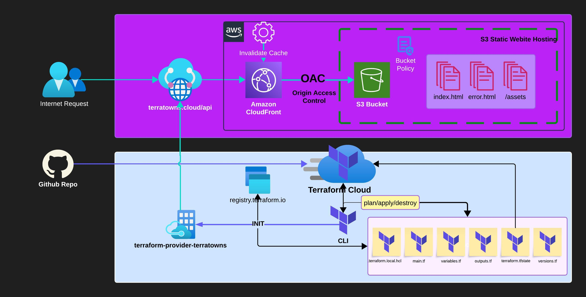

# terraform-beginner-bootcamp-2023

**Terraform AWS Cloud Project Bootcamp**

* This Terraform bootcamp provides you with all the necessary knowledge to begin implementing Terraform in your infrastructure and to develop the skills for using infrastructure as code.

> Journal

[journal week-0](journal/week0.md)

[journal week-1](journal/week1.md)

[journal week-2](journal/week2.md)

> Diagramm for our project

> Tools and Services implemented

- AWS CloudFront (Origin Access Control, Distribution, Woring with Cache)
- AWS S3 (S3 static website hosting, bucket policy for cloudfront OAC)
- Terraform (Local, Modules, Function and etc.)
- Terraform Cloud (Remote usage)
- Build Custom Terrafom Provider
- Github (Github Flow, branching, versioning/tags and etc.)

> Video Tutorial Content

[ExamPro Terraform Beginner Bootcamp](https://www.youtube.com/watch?v=eiox8xFsCpE&list=PLBfufR7vyJJ4q5YCPl4o2XAzGRZUjuD-A&ab_channel=ExamPro)

Usefull Tool for *.md files: [TOC Generator](https://ecotrust-canada.github.io/markdown-toc/)
