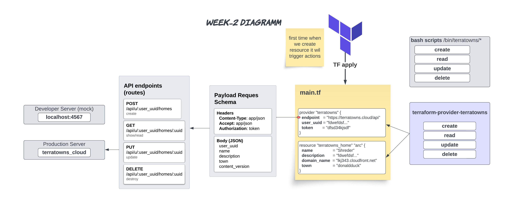

# Week 2 — Terraform Beginner Bootcamp 2023

## Diagramm and Plan

In Week 2, we aim to create a developer mock server for testing our API, using bash scripts for this purpose. Afterward, we will set up a production server and implement terraform-provider-terratowns for general use.

> Our workplan and Diagramm



## Developer Mock Server

* Download [mock server](https://github.com/ExamProCo/terratowns_mock_server.git)

```sh
git clone https://github.com/ExamProCo/terratowns_mock_server.git
```

* Install ruby [Ruby installation Ubuntu](https://itslinuxfoss.com/install-ruby-ubuntu-22-04/#:~:text=There%20are%20several%20ways%20or,2%E2%80%9D%20command.)

* Install bundler

```sh
sudo gem install bundler
bundler --version
```

* Install gems (dependencies)

```sh
bundle install
```

* Install ruby script

```sh
bundle exec ruby server.rb
```

When you use `bundle exec`, it ensures that the script is run with the gems and their versions specified in the project's Gemfile.lock. This helps avoid conflicts between different versions of gems and ensures that your project's dependencies are used consistently.

