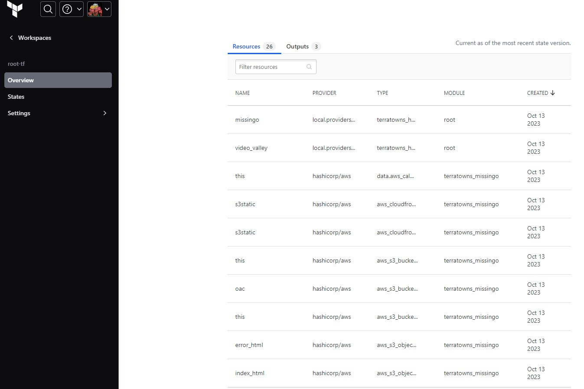

# Week 2 — Terraform Beginner Bootcamp 2023

## Diagramm and Plan

In Week 2, we aim to create a developer mock server for testing our API, using bash scripts for this purpose. Afterward, we will set up a production server and implement terraform-provider-terratowns for general use.

> Our workplan and Diagramm


## Developer Mock Server

* Download [mock server](https://github.com/ExamProCo/terratowns_mock_server.git)

```sh
git clone https://github.com/ExamProCo/terratowns_mock_server.git
```

* Install ruby [Ruby installation Ubuntu](https://itslinuxfoss.com/install-ruby-ubuntu-22-04/#:~:text=There%20are%20several%20ways%20or,2%E2%80%9D%20command.)

* Install bundler

```sh
sudo gem install bundler
bundler --version
```

* Install gems (dependencies)

```sh
sudo bundle install
```

* Install ruby script

```sh
bundle exec ruby server.rb
```

When you use `bundle exec`, it ensures that the script is run with the gems and their versions specified in the project's Gemfile.lock. This helps avoid conflicts between different versions of gems and ensures that your project's dependencies are used consistently.

## Implement terraform-provider-terratowns Custom Provider

To Create custom terraform provider we should do the next steps:

### Create `main.go` file in the new `./terraform-provider-terratowns` directory

> `main.go`

```go
// package main: Declares the package name. 
// The main package is special in Go, it's where the execution of the program starts.
package main

// fmt is short format, it contains functions for formatted I/O.
import (
	"bytes"
	"context"
	"encoding/json"
	"net/http"
	"log"
	"fmt"
	"github.com/google/uuid"
	"github.com/hashicorp/terraform-plugin-sdk/v2/diag"
	"github.com/hashicorp/terraform-plugin-sdk/v2/helper/schema"
	"github.com/hashicorp/terraform-plugin-sdk/v2/plugin"
)
// func main(): Defines the main function, the entry point of the app. 
// When you run the program, it starts executing from this function.
func main() {
	plugin.Serve(&plugin.ServeOpts{
		ProviderFunc: Provider,
	})
	// Format.PrintLine
	// Prints to standard output
	fmt.Println("Hello, world!")
}

type Config struct {
	Endpoint string
	Token string
	UserUuid string
}

// in golang, a titlecase function will get exported.
func Provider() *schema.Provider {
	var p *schema.Provider
	p = &schema.Provider{
		ResourcesMap:  map[string]*schema.Resource{
			"terratowns_home": Resource(),
		},
		DataSourcesMap:  map[string]*schema.Resource{

		},
		Schema: map[string]*schema.Schema{
			"endpoint": {
				Type: schema.TypeString,
				Required: true,
				Description: "The endpoint for hte external service",
			},
			"token": {
				Type: schema.TypeString,
				Sensitive: true, // make the token as sensitive to hide it the logs
				Required: true,
				Description: "Bearer token for authorization",
			},
			"user_uuid": {
				Type: schema.TypeString,
				Required: true,
				Description: "UUID for configuration",
				ValidateFunc: validateUUID,
			},
		},
	}
	p.ConfigureContextFunc = providerConfigure(p)
	return p
}

func validateUUID(v interface{}, k string) (ws []string, errors []error) {
	log.Print("validateUUID:start")
	value := v.(string)
	if _, err := uuid.Parse(value); err != nil {
		errors = append(errors, fmt.Errorf("invalid UUID format"))
	}
	log.Print("validateUUID:end")
	return
}

func providerConfigure(p *schema.Provider) schema.ConfigureContextFunc {
	return func(ctx context.Context, d *schema.ResourceData) (interface{}, diag.Diagnostics ) {
		log.Print("providerConfigure:start")
		config := Config{
			Endpoint: d.Get("endpoint").(string),
			Token: d.Get("token").(string),
			UserUuid: d.Get("user_uuid").(string),
		}
		log.Print("providerConfigure:end")
		return &config, nil
	}
}

func Resource() *schema.Resource {
	log.Print("Resource:start")
	resource := &schema.Resource{
		CreateContext: resourceHouseCreate,
		ReadContext: resourceHouseRead,
		UpdateContext: resourceHouseUpdate,
		DeleteContext: resourceHouseDelete,
		Schema: map[string]*schema.Schema{
			"name": {
				Type: schema.TypeString,
				Required: true,
				Description: "Name of home",
			},
			"description": {
				Type: schema.TypeString,
				Required: true,
				Description: "Description of home",
			},
			"domain_name": {
				Type: schema.TypeString,
				Required: true,
				Description: "Domain name of home eg. *.cloudfront.net",
			},
			"town": {
				Type: schema.TypeString,
				Required: true,
				Description: "The town to which the home will belong to",
			},
			"content_version": {
				Type: schema.TypeInt,
				Required: true,
				Description: "The content version of the home",
			},
		},
	}
	log.Print("Resource:start")
	return resource
}

func resourceHouseCreate(ctx context.Context, d *schema.ResourceData, m interface{}) diag.Diagnostics {
	log.Print("resourceHouseCreate:start")
	var diags diag.Diagnostics

	config := m.(*Config)

	payload := map[string]interface{}{
		"name": d.Get("name").(string),
		"description": d.Get("description").(string),
		"domain_name": d.Get("domain_name").(string),
		"town": d.Get("town").(string),
		"content_version": d.Get("content_version").(int),
	}
	payloadBytes, err := json.Marshal(payload)
	if err != nil {
		return diag.FromErr(err)
	}

	url :=  config.Endpoint+"/u/"+config.UserUuid+"/homes"
	log.Print("URL: "+ url)
	// Construct the HTTP Request
	req, err := http.NewRequest("POST", url, bytes.NewBuffer(payloadBytes))
	if err != nil {
		return diag.FromErr(err)
	}

	// Set Headers
	req.Header.Set("Authorization", "Bearer "+config.Token)
	req.Header.Set("Content-Type", "application/json")
	req.Header.Set("Accept", "application/json")

	client := http.Client{}
	resp, err := client.Do(req)
	if err != nil {
		return diag.FromErr(err)
	}
	defer resp.Body.Close()

	// parse response JSON
	var responseData map[string]interface{}
	if err := json.NewDecoder(resp.Body).Decode(&responseData);  err != nil {
		return diag.FromErr(err)
	}

	// StatusOK = 200 HTTP Response Code
	if resp.StatusCode != http.StatusOK {
		return diag.FromErr(fmt.Errorf("failed to create home resource, status_code: %d, status: %s, body %s", resp.StatusCode, resp.Status, responseData))
	}

	// handle response status

	homeUUID := responseData["uuid"].(string)
	d.SetId(homeUUID)

	log.Print("resourceHouseCreate:end")

	return diags
}

func resourceHouseRead(ctx context.Context, d *schema.ResourceData, m interface{}) diag.Diagnostics {
	log.Print("resourceHouseRead:start")
	var diags diag.Diagnostics

	config := m.(*Config)

	homeUUID := d.Id()

	// Construct the HTTP Request
	url := config.Endpoint+"/u/"+config.UserUuid+"/homes/"+homeUUID
	log.Print("URL: "+ url)
	req, err := http.NewRequest("GET", url, nil)
	if err != nil {
		return diag.FromErr(err)
	}

	// Set Headers
	req.Header.Set("Authorization", "Bearer "+config.Token)
	req.Header.Set("Content-Type", "application/json")
	req.Header.Set("Accept", "application/json")

	client := http.Client{}
	resp, err := client.Do(req)
	if err != nil {
		return diag.FromErr(err)
	}
	defer resp.Body.Close()

	var responseData map[string]interface{}

	if resp.StatusCode == http.StatusOK {
		// parse response JSON
		if err := json.NewDecoder(resp.Body).Decode(&responseData);  err != nil {
			return diag.FromErr(err)
		}
		d.Set("name",responseData["name"].(string))
		d.Set("description",responseData["description"].(string))
		d.Set("domain_name",responseData["domain_name"].(string))
		d.Set("content_version",responseData["content_version"].(float64))
	} else if resp.StatusCode != http.StatusNotFound {
		d.SetId("")
	} else if resp.StatusCode != http.StatusOK {
		return diag.FromErr(fmt.Errorf("failed to read home resource, status_code: %d, status: %s, body %s", resp.StatusCode, resp.Status, responseData))
	}

	log.Print("resourceHouseRead:end")

	return diags
}

func resourceHouseUpdate(ctx context.Context, d *schema.ResourceData, m interface{}) diag.Diagnostics {
	log.Print("resourceHouseUpdate:start")
	var diags diag.Diagnostics

	config := m.(*Config)

	homeUUID := d.Id()

	payload := map[string]interface{}{
		"name": d.Get("name").(string),
		"description": d.Get("description").(string),
		"content_version": d.Get("content_version").(int),
	}
	payloadBytes, err := json.Marshal(payload)
	if err != nil {
		return diag.FromErr(err)
	}

	// Construct the HTTP Request
	url := config.Endpoint+"/u/"+config.UserUuid+"/homes/"+homeUUID
	log.Print("URL: "+ url)
	req, err := http.NewRequest("PUT", url, bytes.NewBuffer(payloadBytes))
	if err != nil {
		return diag.FromErr(err)
	}

	// Set Headers
	req.Header.Set("Authorization", "Bearer "+config.Token)
	req.Header.Set("Content-Type", "application/json")
	req.Header.Set("Accept", "application/json")

	client := http.Client{}
	resp, err := client.Do(req)
	if err != nil {
		return diag.FromErr(err)
	}
	defer resp.Body.Close()

	// StatusOK = 200 HTTP Response Code
	if resp.StatusCode != http.StatusOK {
		return diag.FromErr(fmt.Errorf("failed to update home resource, status_code: %d, status: %s", resp.StatusCode, resp.Status))
	}

	log.Print("resourceHouseUpdate:end")

	d.Set("name",payload["name"])
	d.Set("description",payload["description"])
	d.Set("content_version",payload["content_version"])
	return diags
}

func resourceHouseDelete(ctx context.Context, d *schema.ResourceData, m interface{}) diag.Diagnostics {
	log.Print("resourceHouseDelete:start")
	var diags diag.Diagnostics

	config := m.(*Config)

	homeUUID := d.Id()

	// Construct the HTTP Request
	url :=  config.Endpoint+"/u/"+config.UserUuid+"/homes/"+homeUUID
	log.Print("URL: "+ url)
	req, err := http.NewRequest("DELETE", url , nil)
	if err != nil {
		return diag.FromErr(err)
	}

	// Set Headers
	req.Header.Set("Authorization", "Bearer "+config.Token)
	req.Header.Set("Content-Type", "application/json")
	req.Header.Set("Accept", "application/json")

	client := http.Client{}
	resp, err := client.Do(req)
	if err != nil {
		return diag.FromErr(err)
	}
	defer resp.Body.Close()

	// StatusOK = 200 HTTP Response Code
	if resp.StatusCode != http.StatusOK {
		return diag.FromErr(fmt.Errorf("failed to delete home resource, status_code: %d, status: %s", resp.StatusCode, resp.Status))
	}

	d.SetId("")

	log.Print("resourceHouseDelete:end")
	return diags
}
```

### Install all `go` dependencies

> to install `go` dependencies from `main.go` run command in the corresponding go directory

```sh
# enabling dependency tracking in your code
go mod init <mymodule>

# adding all dependency
go get .
```

### Create script `./bin/build_provider` for local building our custom provider

> `build_provider` script

```sh
#! /usr/bin/env bash

PLUGIN_DIR="/home/gitpod/.terraform.d/plugins/local.providers/local/terratowns/1.0.0/"
PLUGIN_NAME="terraform-provider-terratowns_v1.0.0"

# https://servian.dev/terraform-local-providers-and-registry-mirror-configuration-b963117dfffa
cd $THEIA_WORKSPACE_ROOT/terraform-provider-terratowns
cp $THEIA_WORKSPACE_ROOT/terraformrc /home/gitpod/.terraformrc
rm -rf /home/gitpod/.terraform.d/plugins
rm -rf $THEIA_WORKSPACE_ROOT/.terraform
rm -rf $THEIA_WORKSPACE_ROOT/.terraform.lock.hcl
go build -o $PLUGIN_NAME
mkdir -p $PLUGIN_DIR/x86_64/
mkdir -p $PLUGIN_DIR/linux_amd64/
cp $PLUGIN_NAME $PLUGIN_DIR/x86_64
cp $PLUGIN_NAME $PLUGIN_DIR/linux_amd64
```

### Create `terraform.rc` to provide local custom provider execution

> `terraform.rc` root terraform project dir

```rc
provider_installation {
  filesystem_mirror {
    path = "/home/gitpod/.terraform.d/plugins"
    include = ["local.providers/*/*"]
  } 
  direct {
   exclude = ["local.providers/*/*"] 
  }
}
```

### Build Custom Terraform Provider for Local Use

> add execution privilege for `build_provider` script and run

```sh
# add privilege
chmod u+x ./bin/build_provider
# run script
source ./bin/build_provider
```

### Implement Connections to Terratowns  

* Add Resource from Terrahouse module to main.tf and upload to terratowns.cloud/api

> `main.tf`

```tf
resource "terratowns_home" "missingo" {
  name = "==== Rick & Morty. Who Are They??? ===="
  description = <<EOF
    "Rick and Morty" is an American animated science fiction sitcom created by Justin Roiland and Dan Harmon. The show first premiered in 2013 and has gained a dedicated fan following. 
    The series primarily focuses on the adventures of its two main characters, Rick Sanchez and Morty Smith.
    Rick Sanchez is an eccentric, brilliant, and often morally ambiguous scientist. He's known for his disregard for conventional rules and ethics. 
    Morty Smith, on the other hand, is Rick's easily influenced and somewhat naive grandson. Morty often finds himself reluctantly accompanying Rick on various interdimensional and extraterrestrial adventures.
  EOF

  domain_name = module.terratowns_missingo.cloudfront_url
  town = "missingo"
  content_version = 1
}

module "terratowns_video_valley" {
  source          = "./modules/terrahouse"
  public_path     = var.video_valley.public_path 
  content_version = var.video_valley.content_version 
  user_uuid       = var.user_uuid
}

resource "terratowns_home" "video_valley" {
  name = "==== Rick & Morty. Who Are They??? ===="
  description = <<EOF
    "Rick and Morty" is an American animated science fiction sitcom created by Justin Roiland and Dan Harmon. The show first premiered in 2013 and has gained a dedicated fan following. 
    The series primarily focuses on the adventures of its two main characters, Rick Sanchez and Morty Smith.
    Rick Sanchez is an eccentric, brilliant, and often morally ambiguous scientist. He's known for his disregard for conventional rules and ethics. 
    Morty Smith, on the other hand, is Rick's easily influenced and somewhat naive grandson. Morty often finds himself reluctantly accompanying Rick on various interdimensional and extraterrestrial adventures.
    The show blends elements of dark humor, satire, and absurdity. It explores a wide range of science fiction concepts, such as alternate dimensions, time travel, and advanced technology, while also addressing philosophical and ethical questions.
  EOF
  domain_name = module.terratowns_video_valley.cloudfront_url
  town = "video-valley"
  content_version = 1
}
```

* Run terraform init/plan/apply and you should see your resources in terraform cloud 



* and your post in `https://terratowns.cloud/api` website


* Save and commit your progress, update documents info for your project and merge to main branch 

WELL DONE!!!
